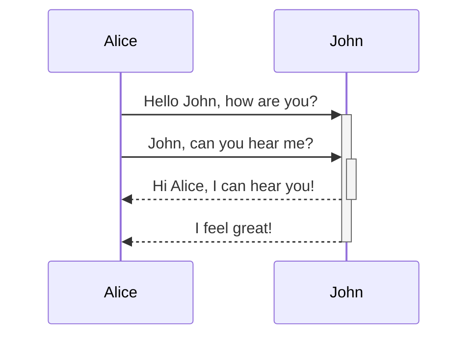

Most of these were grabbed from the Obsidian Sandbox vault.
# Blockquote
>This is a blockquote.

# Callout
## Note
>[!NOTE]
> This is a note callout.
## Info
> [!INFO]
> Here's an info callout block.
> It supports **markdown** and [[Internal link|wikilinks]].
## Foldable
> [!FAQ]- Are callouts foldable?
> Yes! In a foldable callout, the contents are hidden until it is expanded.

# Code Block
## Javascript
```js
function hello(arg){
	console.log(`hello, ${arg}`);
}
```
## Generic
```
Just a generic code block
```

# Comment
Here is some inline comments: %%You can't see this text%% (Can't see it)

Here is a block comment:
%%
It can span
multiple lines
%%
(Can't see it)

# Diagram


# Embeds
![[Embeds]]

# Emphasis
*This text will be italic*
_This will also be italic_

**This text will be bold**
__This will also be bold__

_You **can** combine them_

# Footnote
Here's a simple footnote,[^1] and here's a longer one.[^bignote]

[^1]: meaningful!

[^bignote]: Here's one with multiple paragraphs and code.
	Indent paragraphs to include them in the footnote.
	Add as many paragraphs as you like.

# This is a heading 1
## This is a heading 2
### This is a heading 3 
#### This is a heading 4
##### This is a heading 5
###### This is a heading 6

# Highlighting
Use two equal signs to ==highlight text==.

# Horizontal Divider
Use three stars 
***
, minuses

---
, or underscores 
___
in a new line to produce an horizontal bar.

# Images
## From URL

### Resized

## From Vault
![[obsidian_banner.png]]
### Resized
![[obsidian_banner.png|200]]

# Inline code
Text inside `backticks` on a line will be formatted like code.

# Internal Link
Link to a page: [[Embeds]].
Using an alias: [[Embeds | This is an alias!]]
# Links
## URLs
http://obsidian.md - automatic!
[Obsidian](http://obsidian.md)
## Obsidian URI links
This shouldn't work because it uses file paths. These shouldn't be used in Foundry anyway.
[Link to note](obsidian://open?path=D:%2Fpath%2Fto%2Ffile.md) (doesn't exist)
## Absolute Links
Apples the fruit: [[My Folder/Fruits/Apple]]
Apples the company: [[My Folder/Companies/Apple]]
# Lists
- Item 1
- Item 2
  - Item 2a
  - Item 2b

1. Item 1
1. Item 2
1. Item 3
   1. Item 3a
   1. Item 3b

# Math
$$\begin{vmatrix}a & b\\
c & d
\end{vmatrix}=ad-bc$$
You can also do inline math like $e^{2i\pi} = 1$ .

# Strikethrough
Any word wrapped with two tildes (like ~~this~~) will appear crossed out.

# Tables
First Header | Second Header
------------ | ------------
Content from cell 1 | Content from cell 2
Content in the first column | Content in the second column

Tables can be justified with a colon | Another example with a long title
:----------------|-------------:
because of the `:` | these will be justified

First Header | Second Header
------------ | ------------
[[Embeds\|You should see this]]	|  Just escaping the \| pipe character

# Task
- [x] #tags, [links](), **formatting** supported
- [x] list syntax required (any unordered or ordered list supported)
- [x] this is a complete item
- [?] this is also a complete item (works with every character)
- [ ] this is an incomplete item
- [ ] tasks can be clicked in Preview to be checked off